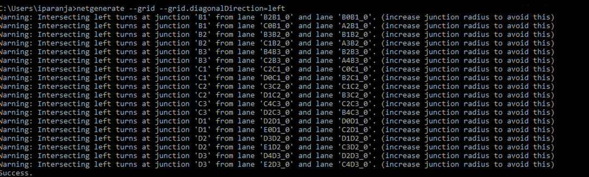

# SumoXMLImporter

## How to run (Tested on UE4.18)

1. After cloning this repository, this project can be run directly by running the uproject file in the project directory. This project imports the "net.net.xml" file in the project directory. (This file was created using netgenerate(SUMO) with custom settings as shown in . Netedit screenshot of 'net.net.xml' is shown in ).

  (a). On the Unreal editor, click on the floor in the viewport and delete it.
  (b). Drag one of the basic actors into the viewport from the 'modes' tab  (e.g. point light).
  (c). In the content browser tab, click on the 'C++ classes' directory. Click on XMLParsingApproach1 directory. Currently the code resides in the 'ActorComponent01' file.
  (d). Click on ActorComponent01 file and drag and place on the pointlight(instance) on the details tab on the right.
  (e). Click 'build' in the toolbar
  (f). Click 'Play'
  
  You should see the edges spawned in the viewport according the SUMO XML File.

2. To view the files on Visual Studio, right-click on the .uproject file on the project directory and select 'Generate Visual Studio files'. This will generate the visual studio solution in the same directory. Open on visual studio.

  (a). You can view the source code by clicking on the Solution Explorer tab, XMLParsingApproach1(VS Solution)->Source->XMLParsingApproach1-> (files).
  
  (b). The spawning code is on ActorComponent01.cpp and the procedural lane meshcode on TestRoadSegment.cpp.
  
  (c). After the changes have been made, save and click on 'local windows debugger'(green play). This should open Unreal Editor. Then follow the steps from 1(a) above.
  
  
